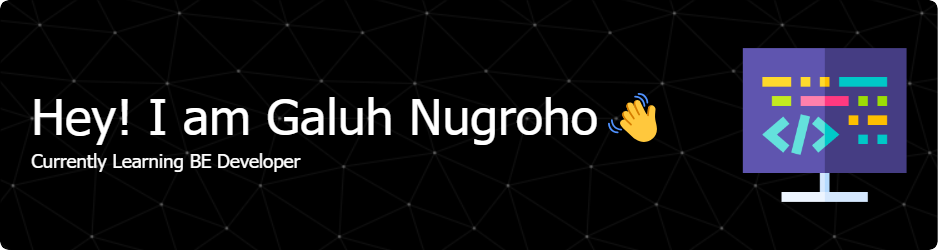

<!--
**galuhnugroho/galuhnugroho** is a ✨ _special_ ✨ repository because its `README.md` (this file) appears on your GitHub profile.

Here are some ideas to get you started:

- 🔭 I’m currently working on ...
- 🌱 I’m currently learning ...
- 👯 I’m looking to collaborate on ...
- 🤔 I’m looking for help with ...
- 💬 Ask me about ...
- 📫 How to reach me: ...
- 😄 Pronouns: ...
- ⚡ Fun fact: ...
-->

<!--  -->

## 
 HELLO WORLD, MY NAME IS GALUH 👋 

🌱 I’m currently learning <strong>Laravel</strong> Framework

##### 💻SKILLS

<!--  -->

<!-- 

 -->

##### 🌐SOCIALS

<!-- ##### MY GITHUB STATS

 -->

<picture>
  <source media="(prefers-color-scheme: dark)" srcset="https://raw.githubusercontent.com/galuhnugroho/galuhnugroho/output/pacman-contribution-graph-dark.svg">
  <source media="(prefers-color-scheme: light)" srcset="https://raw.githubusercontent.com/galuhnugroho/galuhnugroho/output/pacman-contribution-graph.svg">
  
</picture>

###
